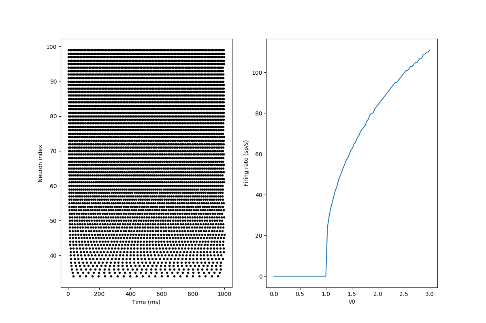
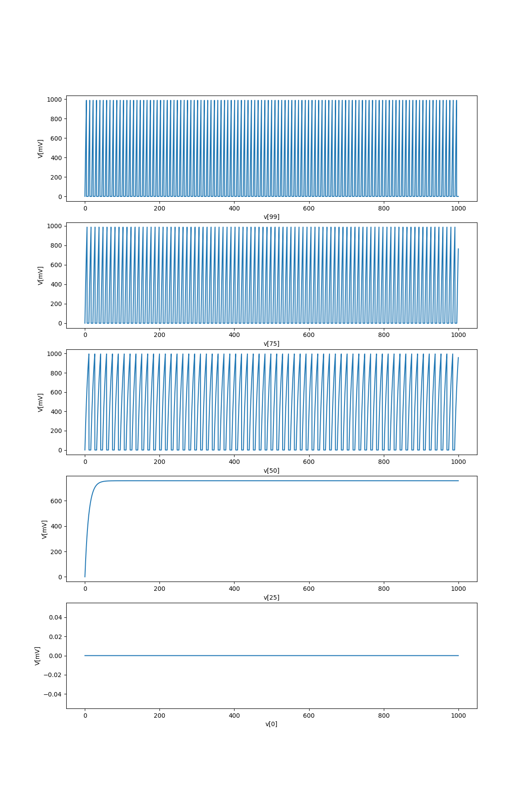
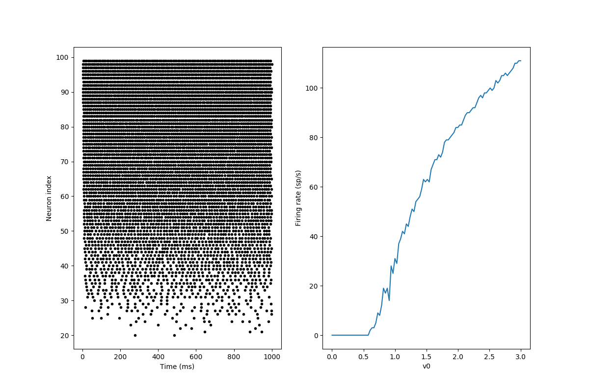
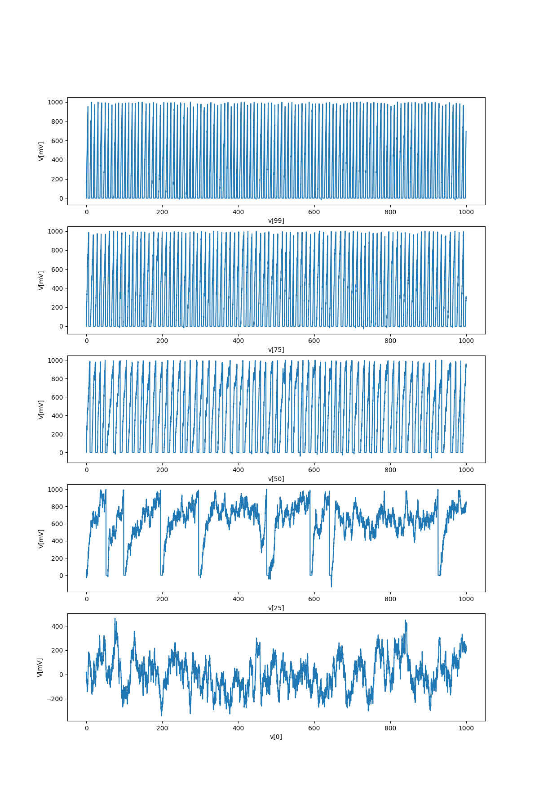

Experiments with brian2 (SNN package)
=====================================

Installation (on Ubuntu 17.10):
-------------------------------

    # apt install python-pip python-tk
    # pip install numpy
    # pip install matplotlib
    # pip install cython
    # pip install brian2
    
Results:
--------

Examples taken from [Brian 2 tutorial: Intro to Brian neurons](https://github.com/brian-team/brian2/blob/master/tutorials/1-intro-to-brian-neurons.ipynb).

* multiple-neurons.py:

  * Spikes and firing rate for various indexes and v0_max values:

  * Graph of V for neurons with various indexes:

* stochastic-neuron.py:

  * Spikes and firing rate for various indexes and v0_max values:

  * Graph of V for neurons with various indexes:

As one can see, firing rate is non-zero for v0 < 1 and even neuron 0 has some non-zero values for V (but it has no spikes). This is because stochasti deffirential was added to the equations.

