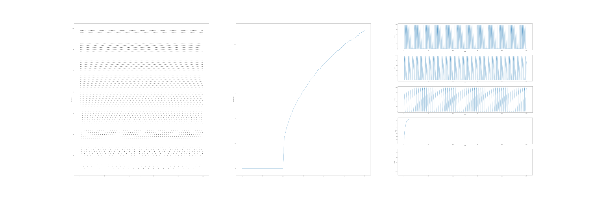

Experiments with brian2 (SNN package)
=====================================

Installation (on Ubuntu 17.10):
-------------------------------

    # apt install python-pip python-tk
    # pip install numpy
    # pip install matplotlib
    # pip install cython
    # pip install brian2
    
Results:
--------

* multiple-neurons.py:

